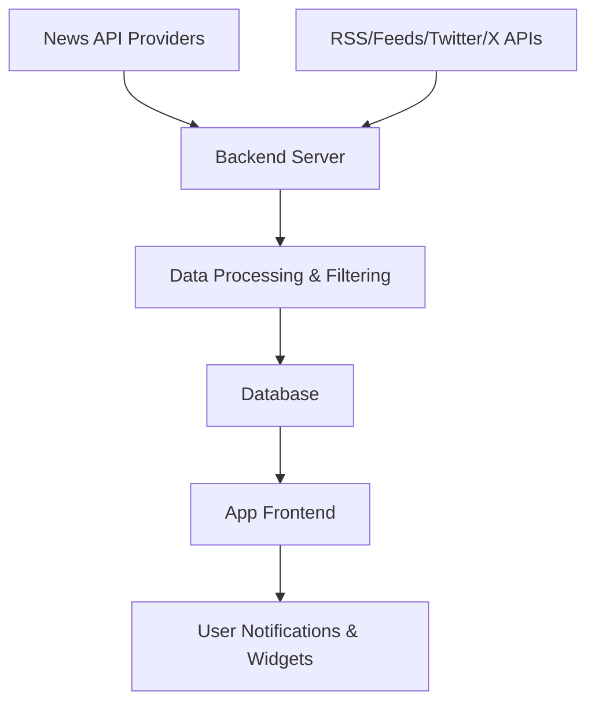

Creating an app that covers **all crypto and forex news** is a powerful idea. You’ll want to provide **real-time, categorized, and region-specific** financial news with possible integrations like signals, charts, tweets, and expert commentary.

---

## ✅ **App Name Suggestion**

> **"FinPulse"** – (Financial Pulse for Crypto & Forex)

---

## 🧠 **App Overview / Concept**

**All-in-one financial news aggregator** for:

* Cryptocurrency markets (Bitcoin, Ethereum, Altcoins)
* Forex markets (EUR/USD, GBP/JPY, etc.)
* Economic calendar updates
* Market trends, signals, charts
* Tweets from top traders/influencers
* Expert opinions, headlines, breaking news

---

## 🔄 **Data Flow Overview**

---

## 🧩 **App Modules / Screens**

### 1. **Home Dashboard**

* 🔥 Trending Crypto News
* 📉 Live Forex Updates
* 📰 Headlines (Top Stories)
* 📈 Global Market Summary

---

### 2. **Crypto News**

* News by Coin (BTC, ETH, DOGE, etc.)
* Category: DeFi, NFTs, Blockchain Tech, Regulation
* Twitter/X Integration (Top trader tweets)
* Video Reports (YouTube/Podcast Embed)

---

### 3. **Forex News**

* Currency Pairs: USD, EUR, GBP, JPY, AUD, etc.
* Technical Analysis & Signals
* Central Bank Updates (FOMC, ECB, BOJ, etc.)
* Real-Time Forex Market Calendar

---

### 4. **Live Charts**

* Forex + Crypto Pair Charts (TradingView Embed or ChartIQ)
* Indicators: RSI, MACD, EMA, etc.
* Technical Levels (Support/Resistance)

---

### 5. **News Categories**

* 🔔 Breaking News
* 📊 Market Analysis
* 💼 Economic Policy
* 📅 Economic Calendar Events
* 🧠 Expert Opinion

---

### 6. **Saved Articles & Alerts**

* Bookmark news
* Custom Alerts for keywords or coins (e.g., “Ethereum crash”)

---

### 7. **Push Notifications**

* Custom alert system (e.g., “Bitcoin crosses \$60,000”)
* News summary 2x per day
* Calendar event reminders

---

## 🔧 **Tech Stack**

### Backend

* **Node.js + Express** (API Gateway)
* **MongoDB** or **PostgreSQL** (News + Users)
* **Cron Jobs** for news updates
* **Redis** (cache trending news)

### Frontend

* **Flutter** or **React Native** (cross-platform)
* **TailwindCSS** if using React Native Web
* **ShadCN UI** or **Material UI** for components

---

### APIs to Use

| Feature        | Source/API Suggestion                                |
| -------------- | ---------------------------------------------------- |
| Crypto News    | CryptoPanic, CoinDesk, CoinTelegraph, NewsAPI, GNews |
| Forex News     | ForexFactory, Investing.com API, NewsData.io         |
| Live Charts    | TradingView Widget, ChartIQ                          |
| Calendar       | Trading Economics API                                |
| Tweets/Signals | Twitter API (filtered by finance influencers)        |
| Price Data     | CoinGecko / Binance / AlphaVantage / TwelveData      |

---

## 🔐 Features You Can Add Later

* User Login (optional)
* Personalized Feed (AI/ML model)
* Premium Membership (ad-free, expert content)
* Multilingual Support
* Signal Room (with copy trade suggestions)

---

## 🧪 Monetization Ideas

* 🧠 Pro Membership for Expert Analysis
* 📢 Native Ads (via Google AdMob / Start.io)
* 💰 Affiliate Links (Broker signup, eToro, Binance)
* 📦 Premium Signal Room (Telegram/Discord Integration)

---

## 🧭 User Journey Example

1. User opens app → Sees trending headlines
2. Taps into “Crypto News” → Filters by “Altcoins”
3. Taps on an article → Reads analysis
4. Sees “Live Price” and “Tweet reactions”
5. Gets a push notification: “Fed Rate Hike Today - Market Reacting”
6. Opens “Economic Calendar” to check event details

---

## 📝 Admin Panel (Optional)

* Upload Custom News
* Manage Sources / APIs
* Push Custom Alerts
* Analytics Dashboard

---

## 🎨 UI Inspiration

* **Bloomberg**
* **CryptoPanic**
* **Investing.com**
* **Inshorts (for short news format)**

---

Would you like a **UI mockup**, **database schema**, or a **Flutter + Node.js boilerplate** for this?
