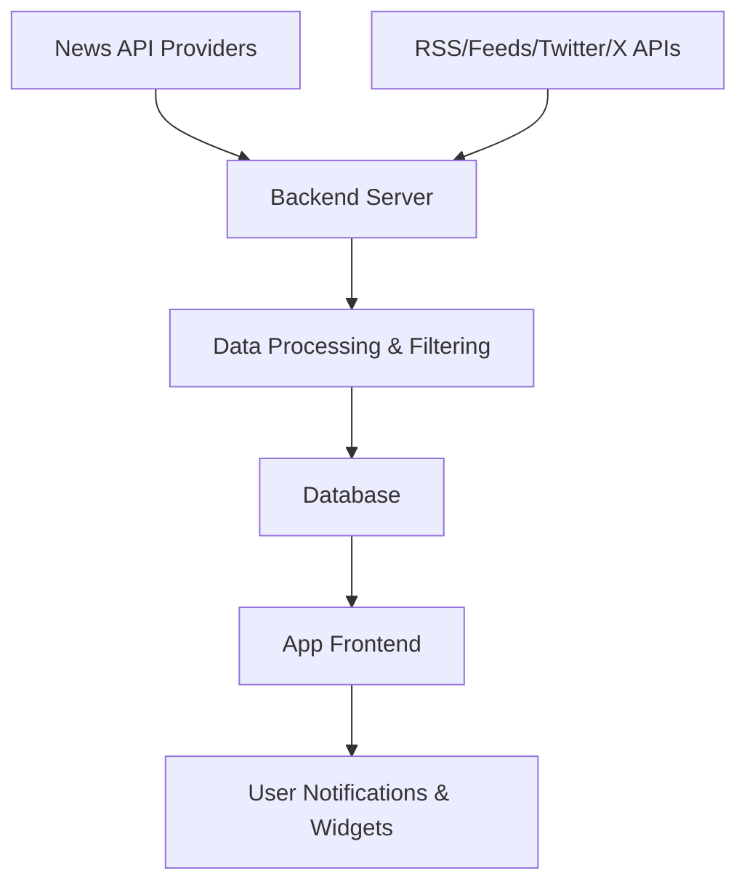

## ✅ **App Name Suggestion**

> **"FinPulse"** – (Financial Pulse for Crypto & Forex)

---
## ProtoType:

Here’s a **complete UI Prototype Documentation** for your **Crypto & Forex News Website** — designed to be professional, mobile-responsive, SEO-optimized, and suitable for Play Store/Web launches.

---

# 📑 UI Prototype Documentation

**Project**: Crypto & Forex News Platform
**Type**: Web App
**Scope**: Aggregated and self-written news for global crypto and forex coverage.

---

## 🧱 1. Pages / Screens Structure

| Route            | Page Name             | Description                                        |
| ---------------- | --------------------- | -------------------------------------------------- |
| `/`              | Home                  | Trending, latest, crypto, and forex news blocks    |
| `/crypto`        | Crypto News           | Filtered news (BTC, ETH, Altcoins, NFTs, DeFi)     |
| `/forex`         | Forex News            | Forex market news by currency pair or country      |
| `/article/:slug` | Article Detail        | Full article with tags, date, author, social share |
| `/search`        | Search Results        | Articles filtered by query                         |
| `/tags/:tag`     | Tag Page              | Articles with selected tag                         |
| `/about`         | About Us              | Platform info and disclaimers                      |
| `/contact`       | Contact Us            | Feedback form or contact info                      |
| `/admin`         | Admin Panel (private) | Content management                                 |

---

## 🎯 2. UI Component System

### A. **Navigation Bar (Header)**

* Logo (left)
* Menu: Home, Crypto, Forex, About, Contact
* Search icon
* Mobile hamburger menu

### B. **Hero Section (Home)**

* Title: “Stay Ahead with Real-Time Crypto & Forex News”
* CTA Button (optional): “Bookmark” or “Get Daily Email”
* Background Image or Chart Animation (optional)

### C. **Trending / Featured News**

* Carousel or horizontal scroll
* Includes image, title, category, source, date

### D. **News Blocks (Category Sections)**

Each block shows:

* Headline
* Thumbnail
* Excerpt
* Published Date
* Source Icon/Logo
* Tag chips (e.g., #Bitcoin #FedRate)

### E. **Article Detail Page**

* Title, date, category, tags
* Feature image
* Article content (HTML / Markdown rendered)
* Social share icons
* Author info (optional)
* Related articles

### F. **Sidebar (Optional)**

* Newsletter signup box
* Trending tags
* Economic calendar embed (optional)
* Small ad or sponsored link

### G. **Footer**

* Quick links: About, Contact, Disclaimer
* Social icons
* Attribution to sources (e.g., “News powered by CoinDesk, ForexFactory”)

---

## 🧩 3. Design System (Style Guide)

### Typography

| Element   | Font            | Size    | Weight  |
| --------- | --------------- | ------- | ------- |
| Headlines | Poppins / Inter | 24–36px | 600–700 |
| Body Text | Inter / Roboto  | 16px    | 400     |
| Captions  | Inter / Roboto  | 12–14px | 300–400 |

### Colors

| Role             | Color Hex                             |
| ---------------- | ------------------------------------- |
| Primary Accent   | `#0F172A` (dark blue)                 |
| Secondary Accent | `#22D3EE` (cyan)                      |
| Background       | `#FFFFFF` (light) or `#0B0B0F` (dark) |
| Text Main        | `#1E293B` (dark gray)                 |
| Text Muted       | `#94A3B8` (cool gray)                 |

### Buttons

* **Primary**: Filled cyan button `#22D3EE`
* **Secondary**: Outline button, white or gray text
* Rounded corners (`rounded-xl`)
* Hover: brightness increase, shadow

---

## 📲 4. Mobile Responsiveness

| View        | Layout Changes                          |
| ----------- | --------------------------------------- |
| Tablet      | Grid to stacked columns, smaller font   |
| Mobile      | Hamburger menu, cards become full width |
| Breakpoints | `sm: 640px`, `md: 768px`, `lg: 1024px`  |

---

## 🔍 5. Search & Filter UX

* 🔎 Input with debounce (300ms)
* Filters:

  * Category dropdown
  * Tags (clickable chips)
  * Date (last 24h, this week, etc.)
* Sorting:

  * Latest
  * Most Viewed
  * Source (optional)

---

## 🧠 6. UX Flows

### 1. **Browse News**

* Home → Click Crypto → View articles → Click article → Read

### 2. **Search Flow**

* Click 🔍 → Search for “Ethereum” → See filtered results → Click → Read

### 3. **Tag Navigation**

* From article or sidebar, click tag → Go to `/tags/:tag` → Filtered feed

### 4. **Admin Flow (optional)**

* Login → Dashboard → Create Article → Upload image → Publish

---

## 📥 7. Assets to Include

| Asset Type         | Usage                          |
| ------------------ | ------------------------------ |
| Logos              | Website branding               |
| Icons (SVG)        | Tags, Search, Share, Calendar  |
| Social Media Logos | Footer + share buttons         |
| Placeholder Images | When articles lack a thumbnail |
| Favicon            | 32x32 .ico or .png             |

---

## 🛠 8. Optional Widgets

| Widget               | Description                           |
| -------------------- | ------------------------------------- |
| 📅 Economic Calendar | Embed from TradingView / ForexFactory |
| 📈 Price Ticker      | CoinGecko or CryptoCompare widget     |
| 🐦 Twitter Feed      | Embedded tweets from influencers      |
| 🔔 Notifications     | Firebase / OneSignal (optional)       |

---

## 💾 9. File Structure (Frontend)

```
/src
├── /components
│   ├── Navbar.jsx
│   ├── Footer.jsx
│   ├── NewsCard.jsx
│   ├── SearchBar.jsx
│   └── TagFilter.jsx
├── /pages
│   ├── index.jsx
│   ├── crypto.jsx
│   ├── forex.jsx
│   ├── article/[slug].jsx
│   ├── tags/[tag].jsx
│   └── search.jsx
├── /utils
│   ├── fetchNews.js
│   └── formatDate.js
├── /assets
│   ├── logo.svg
│   ├── icons/
│   └── placeholder.jpg
└── App.jsx
```

---

## ⚙️ 10. Prototypes (Tools You Can Use)

You can use these tools to build/share clickable prototypes:

* [Figma](https://figma.com/) – for design & developer handoff
* [Adobe XD](https://xd.adobe.com/) – alternate design tool
* [Framer](https://framer.com/) – build UI and interactions
* [Penpot](https://penpot.app/) – free, open-source UI design

---

## ✅ Summary Checklist

| Task                        | Status |
| --------------------------- | ------ |
| Define news categories      | ✅      |
| Build responsive UI         | ✅      |
| Search + Tag filter ready   | ✅      |
| Design system defined       | ✅      |
| Home + Article page planned | ✅      |
| Admin panel (optional)      | ✅      |
| Mobile-first approach       | ✅      |

---

Would you like a **Figma prototype**, **React/Tailwind UI starter**, or a **PDF version** of this documentation next?


## 🧠 **App Overview / Concept**

**All-in-one financial news aggregator** for:

* Cryptocurrency markets (Bitcoin, Ethereum, Altcoins)
* Forex markets (EUR/USD, GBP/JPY, etc.)
* Economic calendar updates
* Market trends, signals, charts
* Tweets from top traders/influencers
* Expert opinions, headlines, breaking news

---

## 🔄 **Data Flow Overview**



---

## 🧩 **App Modules / Screens**

### 1. **Home Dashboard**

* 🔥 Trending Crypto News
* 📉 Live Forex Updates
* 📰 Headlines (Top Stories)
* 📈 Global Market Summary

---

### 2. **Crypto News**

* News by Coin (BTC, ETH, DOGE, etc.)
* Category: DeFi, NFTs, Blockchain Tech, Regulation
* Twitter/X Integration (Top trader tweets)
* Video Reports (YouTube/Podcast Embed)

---

### 3. **Forex News**

* Currency Pairs: USD, EUR, GBP, JPY, AUD, etc.
* Technical Analysis & Signals
* Central Bank Updates (FOMC, ECB, BOJ, etc.)
* Real-Time Forex Market Calendar

---

### 4. **Live Charts**

* Forex + Crypto Pair Charts (TradingView Embed or ChartIQ)
* Indicators: RSI, MACD, EMA, etc.
* Technical Levels (Support/Resistance)

---

### 5. **News Categories**

* 🔔 Breaking News
* 📊 Market Analysis
* 💼 Economic Policy
* 📅 Economic Calendar Events
* 🧠 Expert Opinion

---

### 6. **Saved Articles & Alerts**

* Bookmark news
* Custom Alerts for keywords or coins (e.g., “Ethereum crash”)

---

### 7. **Push Notifications**

* Custom alert system (e.g., “Bitcoin crosses \$60,000”)
* News summary 2x per day
* Calendar event reminders

---

## 🔧 **Tech Stack**

### Backend

* **Node.js + Express** (API Gateway)
* **MongoDB** or **PostgreSQL** (News + Users)
* **Cron Jobs** for news updates
* **Redis** (cache trending news)

### Frontend

* **Flutter** or **React Native** (cross-platform)
* **TailwindCSS** if using React Native Web
* **ShadCN UI** or **Material UI** for components

---

### APIs to Use

| Feature        | Source/API Suggestion                                |
| -------------- | ---------------------------------------------------- |
| Crypto News    | CryptoPanic, CoinDesk, CoinTelegraph, NewsAPI, GNews |
| Forex News     | ForexFactory, Investing.com API, NewsData.io         |
| Live Charts    | TradingView Widget, ChartIQ                          |
| Calendar       | Trading Economics API                                |
| Tweets/Signals | Twitter API (filtered by finance influencers)        |
| Price Data     | CoinGecko / Binance / AlphaVantage / TwelveData      |

---

## 🔐 Features You Can Add Later

* User Login (optional)
* Personalized Feed (AI/ML model)
* Premium Membership (ad-free, expert content)
* Multilingual Support
* Signal Room (with copy trade suggestions)

---

## 🧪 Monetization Ideas

* 🧠 Pro Membership for Expert Analysis
* 📢 Native Ads (via Google AdMob / Start.io)
* 💰 Affiliate Links (Broker signup, eToro, Binance)
* 📦 Premium Signal Room (Telegram/Discord Integration)

---

## 🧭 User Journey Example

1. User opens app → Sees trending headlines
2. Taps into “Crypto News” → Filters by “Altcoins”
3. Taps on an article → Reads analysis
4. Sees “Live Price” and “Tweet reactions”
5. Gets a push notification: “Fed Rate Hike Today - Market Reacting”
6. Opens “Economic Calendar” to check event details

---

## 📝 Admin Panel (Optional)

* Upload Custom News
* Manage Sources / APIs
* Push Custom Alerts
* Analytics Dashboard

---

## 🎨 UI Inspiration

* **Bloomberg**
* **CryptoPanic**
* **Investing.com**
* **Inshorts (for short news format)**

---

Would you like a **UI mockup**, **database schema**, or a **Flutter + Node.js boilerplate** for this?
